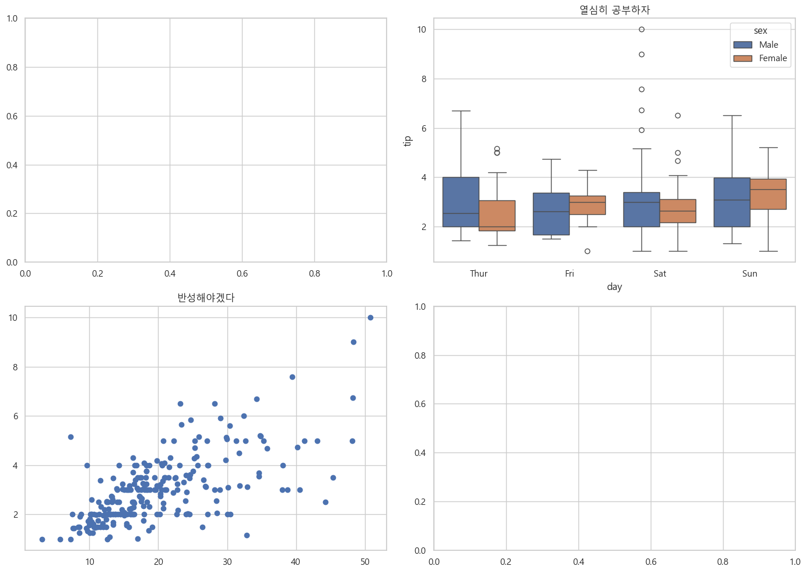
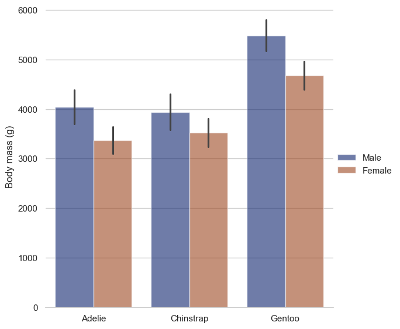

## 시각화 연습
- matplotlib와 seaborn을 활용하여 다양한 시각화를 해본다.
- 시각화는 2 x 2 형태로 나오도록 한다. (예시)

- 시각화는 seaborn 라이브러리 참조해서 적용 (~9시 20분)


```python
import seaborn as sns
import matplotlib.pyplot as plt
tips = sns.load_dataset('tips')

# 한글 기본 폰트 사용 가능 (Mac에서는 다름)
# 만약, 다른 폰트 적용 원하면 
# 참조 : https://dschloe.github.io/python/2023/02/matplotlib_koreanfont/
plt.rcParams['font.family'] = 'Malgun Gothic' # 옵션 설정
fig, ax = plt.subplots(2, 2, figsize=(14, 10))

ax[0, 1].set_title("열심히 공부하자")
sns.boxplot(data=tips, x="day", y="tip", hue="sex", ax = ax[0, 1]) # seaborn
ax[1, 0].scatter(tips['total_bill'], tips['tip']) # matplotlib
ax[1, 0].set_title("반성해야겠다")

plt.tight_layout() # 간격 조정
plt.savefig('yourname.png', dpi=300) # 시각화 내보내기
plt.show() # End 지점
```


    
<p align="center">
 
</p>
    


```python
- 공식문서에서 기본예제를 가저옴
- 해당 코드를 분석해서 내꺼에 적용
```


```python
import seaborn as sns
sns.set_theme(style="whitegrid")

penguins = sns.load_dataset("penguins")

# Draw a nested barplot by species and sex
g = sns.catplot(
    data=penguins, kind="bar",
    x="species", y="body_mass_g", hue="sex",
    errorbar="sd", palette="dark", alpha=.6, height=6
)
g.despine(left=True)
g.set_axis_labels("", "Body mass (g)")
g.legend.set_title("")
```


    
<p align="center">
 
</p>
    


## Plotly 시각화 기본예제


```python
import seaborn as sns 
import plotly.graph_objects as go 
import plotly.express as px

# 데이터 가져오기 
diamonds = sns.load_dataset("diamonds")
diamonds.head(1)
```


<div>
<style scoped>
    .dataframe tbody tr th:only-of-type {
        vertical-align: middle;
    }

    .dataframe tbody tr th {
        vertical-align: top;
    }

    .dataframe thead th {
        text-align: right;
    }
</style>
<table border="1" class="dataframe">
  <thead>
    <tr style="text-align: right;">
      <th></th>
      <th>carat</th>
      <th>cut</th>
      <th>color</th>
      <th>clarity</th>
      <th>depth</th>
      <th>table</th>
      <th>price</th>
      <th>x</th>
      <th>y</th>
      <th>z</th>
    </tr>
  </thead>
  <tbody>
    <tr>
      <th>0</th>
      <td>0.23</td>
      <td>Ideal</td>
      <td>E</td>
      <td>SI2</td>
      <td>61.5</td>
      <td>55.0</td>
      <td>326</td>
      <td>3.95</td>
      <td>3.98</td>
      <td>2.43</td>
    </tr>
  </tbody>
</table>
</div>


```python
# 첫번째 방식 : Graph Objects (High-Level)

fig = go.Figure(
    data = go.Scatter(
        x = diamonds['carat'], y = diamonds['price'], mode = 'markers'
    )
)
fig.update_layout(title = 'Carat vs Price')
fig.show()

# 두번째 방식 : Plotly Express (Low-Level)
fig = px.scatter(data_frame = diamonds, x = 'carat', y = 'price', title = 'Carat vs Price') #seaborn과 문법이 비슷하다
fig.show()


